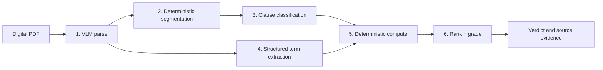

# Clause

Clause turns a digital equipment-financing agreement into a plain-language verdict: what the deal costs, its effective APR, and the clauses most likely to cost the borrower money.

It is built for a contractor deciding whether the advertised terms on a mower, van, camera kit, or other work equipment match the agreement they are being asked to sign. There is no chat interface. The model locates and explains terms; deterministic Python performs every calculation shown to the user.

> **Hackathon status:** the full development benchmark uses Claude Opus 5 downstream. The NVIDIA/Nemotron path (`CLAUSE_PROVIDER=nvidia`) is verified live against `nemotron-parse` and `nvidia/nemotron-3-nano-omni-30b-a3b-reasoning`, but the Nano corpus run is **partial: 3 of 23 documents**. It was stopped at the user's request because NVIDIA API usage is limited and the hosted endpoint rejected concurrent requests. The partial figures below are labelled as such and are not a corpus benchmark.

## What it does

- Accepts a digital PDF and streams progress through parse, segment, classify, extract, and compute stages.
- Shows total cost, effective APR, cost above the advertised terms, and a deterministic A–F risk grade.
- Ranks costly or risky clauses and exposes the exact source quote and page for each one.
- Marks unverified values below 0.5 confidence and withholds totals when required terms are missing—missing never means zero.
- Suggests concrete questions to ask the lender.

The browser UI is a single file with no build step. Open a clause to see its highlighted source wording; for a real upload, the source link opens the corresponding PDF page.

## Architecture



The production provider path uses `nemotron-parse` for structured ingestion and Nemotron 3 Nano for classification and typed extraction. The development path substitutes Claude document input and Claude Opus 5 behind the same `ModelClient` interface.

The Nano model ID originally planned, `nvidia/nemotron-3-nano-30b-a3b`, now returns HTTP 410 from the hosted endpoint and is absent from the authenticated `/v1/models` listing; its catalog page marks the free endpoint deprecated. The configured successor is `nvidia/nemotron-3-nano-omni-30b-a3b-reasoning` (still Nemotron 3 Nano, 30B total / 3B active, multimodal reasoning variant), called with `chat_template_kwargs.enable_thinking=false` so it returns the JSON answer only.

The boundary is deliberate:

- Models may locate a stated number and type it, such as a 3.5% origination fee.
- `clause/compute.py` alone calculates total cost, effective APR, dollar impact, and grade.
- Extracted numeric values are checked against source text. Failed validation lowers confidence to 0.3.
- A missing required input produces an incomplete result with no total—not a confident number based on an invented zero.

Responses are cached by provider, model, and request under `.cache/`; call metadata is appended to `runs/calls.jsonl`. These runtime directories are gitignored and must never contain source financial records for this hackathon build.

## Results

All evaluation PDFs are synthetic. The main corpus contains 20 agreements with 58 planted traps plus 3 clean agreements. A trap counts as caught only when the clause containing its planted source span is marked high/medium **and** receives the expected category.

### Main development benchmark

| Measure | Claude Opus 5 result |
|---|---:|
| Planted-trap recall | **58/58 (100%)** |
| Clean-document false positives | 1 high, 10 medium across 3 docs |
| Core fields exact | 100%, except `term_months` at 21/23 |
| Fee recall / precision | 56/56 (100%) / 56/57 (98%) |
| Total cost and effective APR | 21/23 exact, 0 wrong, 2 withheld |

The two withheld results are biweekly agreements that state 52 installments but never state a term in months. Clause refuses to derive a value that the extraction contract does not provide. Full per-trap, per-field, and per-document evidence is in [`eval_vlm.md`](evals/results/eval_vlm.md) and its machine-readable [`eval_vlm.json`](evals/results/eval_vlm.json).

### Parse comparison: an honest negative result

With Opus downstream, the VLM parser and pdfplumber both reached **58/58 trap recall**, with identical field and computed-result accuracy. The expected “pdfplumber loses fees, so recall collapses” story did not happen.

The parse layers still differ materially:

| Parse evidence | VLM parse | pdfplumber |
|---|---:|---:|
| Structured table-row blocks | 436 | 0 |
| Footnote blocks | 225 | 0 |
| Planted spans intact in one clause | 58/58 | 53/58 |
| Spans lost during parsing | 0 | 5 |
| Off-trap flags on trap docs | 35 | 44 |

The five lost spans are in two-column documents, but Opus still recovered the correct category from interleaved text. The defensible conclusion is that the VLM preserved structure; it did **not** improve downstream recall with this frontier model. Whether that structure changes recall with Nano remains unmeasured. See [`parse_compare.md`](evals/results/parse_compare.md) and [`parse_compare.json`](evals/results/parse_compare.json).

### Cost and latency

The recorded Opus snapshot covers 46 document-runs across both parser columns:

| Measure | Claude Opus 5 |
|---|---:|
| Classify + extract calls per document | 10.35 |
| p50 / p95 model-call latency | 10.177s / 14.073s |
| Total tokens | 1,681,846 |
| Classification + extraction cost per document | **$0.3442** |
| VLM parse cost per document | $0.3196 |

Costs use the configured $5/$25 per million input/output token rates and exclude cache hits. The saved table is [`cost_latency.md`](evals/results/cost_latency.md), with raw aggregates in [`cost_latency.json`](evals/results/cost_latency.json). There is no Nano column and **no cost ratio is claimed**: NVIDIA publishes prototyping access and per-GPU production NIM licensing, not a hosted per-token price for this endpoint, so the Nano price in `config.PRICING` stays `None`. The Nano call log also mixes exploratory probes, repeated smoke runs, and several batch/token configurations, so it is not regenerated into a per-document cost.

### Nemotron Nano: partial result (3 of 23 documents)

Source of truth: [`eval_nano_partial.md`](evals/results/eval_nano_partial.md) / [`eval_nano_partial.json`](evals/results/eval_nano_partial.json), re-scored offline from the three saved analyses in `evals/results/analyses/nano/`. The other 20 documents are listed there as *not run*; nothing is inferred for them.

| Measure | Nano, 3/23 docs (eq_001–eq_003) |
|---|---:|
| Planted-trap recall | 8/8 across 8 trap types |
| Clean-document false positives | not measured (no clean doc in the sample) |
| Core fields exact | 100% (15/15 present fields) |
| Fee recall / precision | 7/8 / 7/8 |
| Total cost and effective APR | 2/3 exact, **1/3 wrong** |
| Clauses left unclassified | 25 of 240 (eq_001: 1, eq_002: 8, eq_003: 16) |

What this does and does not show:

- The pipeline works end to end on the hosted successor model with `nemotron-parse` ingestion, and every planted trap in the sample was surfaced with the right category. Three documents are far too few to compare with the Opus 58/58, and this is **not** a corpus benchmark.
- **Negative result, eq_002:** Nano labelled the $150 documentation fee as an `origination` fee with value `0.15`. The validator correctly dropped it to confidence 0.3 and the analysis carries a warning, but `compute.py` still used the mistyped fee, so the total cost is $149.85 low and the effective APR is 12.00% instead of 12.79%. The arithmetic is honest; the input was wrong. Nothing was tuned to hide this.
- 25 clauses ended with no category or risk (`risk: null` in the saved analyses). The classifier degrades per clause (PLAN T09) when a batch's JSON omits that clause's id or is unusable after one retry; no planted trap fell in those clauses, but a trap that did would have been missed.
- Throughput was poor. The hosted endpoint returned `503 ResourceExhausted` for four-wide, then two-wide, then even sequential eight-clause batches, so the NVIDIA path runs sequentially with 16-clause batches and a 30 s minimum retry after that error. The only uncached wall time in the saved analyses is eq_003 at 277.5 s (classify 262.5 s), most of it capacity back-off; eq_001 and eq_002 were re-saved from cache, so their timings are not measurements. Nano is not claimed to be faster or cheaper here.
- Configuration caveat: eq_001 and eq_002 were classified with the earlier, smaller batch grouping; eq_003 with the final 16-clause sequential setting. All three use the same model with reasoning disabled.

### Adversarial documents

Five attack/control pairs put reviewer-directed manipulation inside the same clauses as planted traps. Controls caught **10/10** traps across 5/5 documents. The completed adversarial runs caught **8/8** across 4/5 documents. The fifth attack document is unscored because the Anthropic account ran out of credit, so the report intentionally does not compute a recall delta. See [`adversarial.md`](evals/results/adversarial.md) and [`adversarial.json`](evals/results/adversarial.json).

## Run locally

Requirements: Python 3.11+ and a provider API key. The commands below use the project virtual environment rather than system Python.

```bash
python3 -m venv .venv
.venv/bin/pip install -e '.[dev]'
cp .env.example .env
```

Edit `.env` for one provider:

```dotenv
# Development path used for the committed results
CLAUSE_PROVIDER=anthropic
ANTHROPIC_API_KEY=your-key

# Or the NVIDIA path (verified live; hosted capacity is tight — see Results)
# CLAUSE_PROVIDER=nvidia
# NVIDIA_API_KEY=your-key
```

Generate the synthetic PDFs, load the environment, and start the app:

```bash
.venv/bin/python data/generate.py
set -a && . ./.env && set +a
.venv/bin/uvicorn api.main:app --reload
```

Open <http://127.0.0.1:8000>. “Try the sample agreement” works without a model call; analyzing a new PDF uses the configured provider. The app accepts digital PDFs up to 25 MB and stores uploads only in a temporary directory for the duration of a request.

CLI usage:

```bash
set -a && . ./.env && set +a
.venv/bin/python -m clause.pipeline data/docs/eq_007.pdf
.venv/bin/python -m clause.pipeline data/docs/eq_007.pdf --baseline --out analysis.json
```

Direct API usage:

```bash
curl -F 'file=@data/docs/eq_007.pdf' http://127.0.0.1:8000/analyze
```

## Reproduce tests and evaluations

The test suite is offline: model behavior is provided by `MockClient`, `ScriptedClient`, and `FlaggingClient`.

```bash
.venv/bin/pytest
```

Saved analyses make the primary reports reproducible without provider calls:

```bash
.venv/bin/python evals/run_eval.py --rescore
.venv/bin/python evals/parse_compare.py --rescore
.venv/bin/python evals/adversarial.py --rescore
```

To generate the paired adversarial PDFs:

```bash
.venv/bin/python data/generate_adversarial.py
```

A new live benchmark requires loading `.env` first. It may incur provider charges:

```bash
set -a && . ./.env && set +a
.venv/bin/python evals/run_eval.py --name vlm
.venv/bin/python evals/parse_compare.py
.venv/bin/python evals/adversarial.py
.venv/bin/python evals/cost_table.py
```

When an Anthropic classify burst returns the known transient `400 Invalid request data`, rerun only the affected document, save its analysis, and use `--rescore`. Do not delete `.cache/`; completed model responses make recovery free.

## Synthetic data and safety

Every lender, borrower, agreement number, amount, and clause in this repository is generated. No real account numbers, credentials, agreements, or financial records are used in the corpus or committed results.

Clause is a decision-support prototype, not legal or financial advice. It highlights language for human verification; it does not determine enforceability or recommend accepting a loan.

The FastAPI service has no authentication and is intended for a local hackathon demo. Do not expose it publicly without authentication, rate limiting, storage review, and provider-key protection.

## Known limitations

- Digital PDFs only; scanned or photographed documents are out of scope.
- The Nano evaluation covers 3 of 23 documents. The full corpus was stopped because NVIDIA API usage is limited and the hosted endpoint rejects concurrent requests; the project makes no Nano-vs-frontier recall or efficiency claim.
- Hosted Nano/Parse per-token pricing is unavailable, so there is no Nano cost column and no cost ratio.
- In the Nano sample, one document's total cost and APR are wrong because a documentation fee was mistyped as an origination fee (flagged low-confidence, but still computed), and 25 of 240 clauses were left unclassified.
- Two biweekly documents omit a literal month term; totals are withheld instead of deriving months from payment count.
- The Opus benchmark has one high and ten medium false positives on clean documents.
- The adversarial comparison is incomplete at 4/5 attack documents because provider credit expired.
- Bounding-box coordinates differ by parser; source quotes and page links work universally, while precise geometric overlays are not attempted.

## Repository guide

```text
clause/       pipeline, provider clients, extraction, classification, computation
api/          FastAPI upload and SSE progress surface
web/          single-file browser UI
data/         deterministic synthetic-corpus generators and golden labels
evals/        scoring, parser comparison, cost table, adversarial benchmark
tests/        offline unit and integration tests
```

The implementation plan and decision trail live in [`PLAN.md`](PLAN.md), [`STATUS.md`](STATUS.md), and [`DECISIONS.md`](DECISIONS.md).
