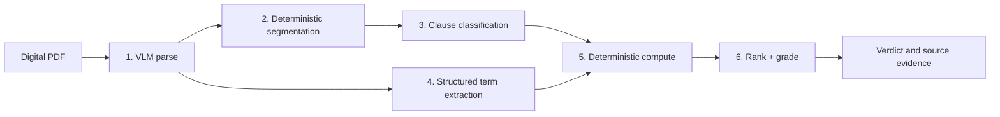

# Clause

Clause turns a digital equipment-financing agreement into a plain-language verdict: what the deal costs, its effective APR, and the clauses most likely to cost the borrower money.

It is built for a contractor deciding whether the advertised terms on a mower, van, camera kit, or other work equipment match the agreement they are being asked to sign. There is no chat interface. The model locates and explains terms; deterministic Python performs every calculation shown to the user.

> **Hackathon status:** two complete runs over the same 23-document corpus. The development benchmark uses Claude Opus 5 downstream; the NVIDIA/Nemotron path (`CLAUSE_PROVIDER=nvidia`, `nemotron-parse` + `nvidia/nemotron-3-nano-omni-30b-a3b-reasoning`) is a full 23/23 run on the free hosted endpoint. Nano matches Opus on trap recall (56/58 vs 58/58) but not on fee typing, so its computed totals are wrong on 15/23 documents — reported below, not hidden. No cost ratio is claimed because the hosted endpoint has no published per-token price.

## What it does

- Accepts a digital PDF and streams progress through parse, segment, classify, extract, and compute stages.
- Shows total cost, effective APR, cost above the advertised terms, and a deterministic A–F risk grade.
- Ranks costly or risky clauses and exposes the exact source quote and page for each one.
- Marks unverified values below 0.5 confidence and withholds totals when required terms are missing—missing never means zero.
- Suggests concrete questions to ask the lender.

The browser UI is a single file with no build step. Open a clause to see its highlighted source wording; for a real upload, the source link opens the corresponding PDF page.

## Architecture



The production provider path uses `nemotron-parse` for structured ingestion and Nemotron 3 Nano for classification and typed extraction. The development path substitutes Claude document input and Claude Opus 5 behind the same `ModelClient` interface.

The Nano model ID originally planned, `nvidia/nemotron-3-nano-30b-a3b`, now returns HTTP 410 from the hosted endpoint and is absent from the authenticated `/v1/models` listing; its catalog page marks the free endpoint deprecated. The configured successor is `nvidia/nemotron-3-nano-omni-30b-a3b-reasoning` (still Nemotron 3 Nano, 30B total / 3B active, multimodal reasoning variant), called with `chat_template_kwargs.enable_thinking=false` so it returns the JSON answer only.

The boundary is deliberate:

- Models may locate a stated number and type it, such as a 3.5% origination fee.
- `clause/compute.py` alone calculates total cost, effective APR, dollar impact, and grade.
- Extracted numeric values are checked against source text. Failed validation lowers confidence to 0.3.
- A missing required input produces an incomplete result with no total—not a confident number based on an invented zero.

Responses are cached by provider, model, and request under `.cache/`; call metadata is appended to `runs/calls.jsonl`. These runtime directories are gitignored and must never contain source financial records for this hackathon build.

## Results

All evaluation PDFs are synthetic. The main corpus contains 20 agreements with 58 planted traps plus 3 clean agreements. A trap counts as caught only when the clause containing its planted source span is marked high/medium **and** receives the expected category.

### Main development benchmark

| Measure | Claude Opus 5 result |
|---|---:|
| Planted-trap recall | **58/58 (100%)** |
| Clean-document false positives | 1 high, 10 medium across 3 docs |
| Core fields exact | 100%, except `term_months` at 21/23 |
| Fee recall / precision | 56/56 (100%) / 56/57 (98%) |
| Total cost and effective APR | 21/23 exact, 0 wrong, 2 withheld |

The two withheld results are biweekly agreements that state 52 installments but never state a term in months. Clause refuses to derive a value that the extraction contract does not provide. Full per-trap, per-field, and per-document evidence is in [`eval_vlm.md`](evals/results/eval_vlm.md) and its machine-readable [`eval_vlm.json`](evals/results/eval_vlm.json).

### Parse comparison: an honest negative result

With Opus downstream, the VLM parser and pdfplumber both reached **58/58 trap recall**, with identical field and computed-result accuracy. The expected “pdfplumber loses fees, so recall collapses” story did not happen.

The parse layers still differ materially:

| Parse evidence | VLM parse | pdfplumber |
|---|---:|---:|
| Structured table-row blocks | 436 | 0 |
| Footnote blocks | 225 | 0 |
| Planted spans intact in one clause | 58/58 | 53/58 |
| Spans lost during parsing | 0 | 5 |
| Off-trap flags on trap docs | 35 | 44 |

The five lost spans are in two-column documents, but Opus still recovered the correct category from interleaved text. The defensible conclusion is that the VLM preserved structure; it did **not** improve downstream recall with this frontier model. Whether that structure changes recall with Nano remains unmeasured. See [`parse_compare.md`](evals/results/parse_compare.md) and [`parse_compare.json`](evals/results/parse_compare.json).

### Cost and latency

The recorded Opus snapshot covers 46 document-runs across both parser columns:

| Measure | Claude Opus 5 |
|---|---:|
| Classify + extract calls per document | 10.35 |
| p50 / p95 model-call latency | 10.177s / 14.073s |
| Total tokens | 1,681,846 |
| Classification + extraction cost per document | **$0.3442** |
| VLM parse cost per document | $0.3196 |

Costs use the configured $5/$25 per million input/output token rates and exclude cache hits. The saved table is [`cost_latency.md`](evals/results/cost_latency.md), with raw aggregates in [`cost_latency.json`](evals/results/cost_latency.json). It has no Nano column and **no cost ratio is claimed**: NVIDIA publishes prototyping access and per-GPU production NIM licensing, not a hosted per-token price for this endpoint, so the Nano price in `config.PRICING` stays `None`. The local Nano call log also mixes exploratory probes, smoke runs, and several batch/token configurations with the corpus run, so per-call Nano latency is not regenerated from it; the per-document wall times in the next section come from the saved analyses instead.

### Nemotron Nano: full corpus, honest split result

Source of truth: [`eval_nano.md`](evals/results/eval_nano.md) / [`eval_nano.json`](evals/results/eval_nano.json), re-scored offline from the 23 saved analyses in `evals/results/analyses/nano/`. Same corpus, same strict scoring, same `nemotron-parse` ingestion; only the classifier/extractor changes.

| Measure | Claude Opus 5 | Nemotron 3 Nano (hosted) |
|---|---:|---:|
| Planted-trap recall | 58/58 (100%) | **56/58 (97%)** |
| Worst trap type | none missed | `T_CROSS_DEFAULT` 4/6 |
| Clean-document false positives (3 docs) | 1 high, 10 medium | 7 high, 20 medium |
| Off-trap flags across 20 trap docs | 35 | 129 |
| Core fields exact | 100% (2 `term_months` withheld) | 100% except `term_months` 21/23 (2 wrong) |
| Fee recall / precision | 56/56 / 56/57 | **43/56 (77%) / 43/55 (78%)** |
| Total cost and effective APR | 21/23 exact, 0 wrong, 2 withheld | **8/23 exact, 15 wrong, 0 withheld** |
| Clauses left unclassified | 0 | 153 of 1,930 (8%) |
| Wall time per document, parse cached | median 32 s, 4-wide classify | median 207 s, sequential (120–278 s; 18 uncached docs) |

What this shows:

- **As a classifier, Nano is close to the frontier model.** 56/58 traps surfaced with the right category. Both misses are `T_CROSS_DEFAULT` (eq_007, eq_015), labelled `standard/low` — the semantically subtle type PLAN §6.1 predicted would score worst. The price is noise: 7× the high-severity false positives on clean documents and ~4× the off-trap flags, so the ranked list is longer and less precise than Opus's.
- **As a typed extractor, Nano is not good enough for the arithmetic to trust.** Core numbers (principal, rate, payment) are 23/23. Fees are the problem: 10 of 16 documentation fees were missed, mostly re-typed as `origination` (9 spurious origination fees), and the `financed` flag on origination fees was wrong 4 times in 10. `compute.py` did exactly what it is designed to do with those inputs, so 15 of 23 totals and APRs are wrong. Ten of the 15 carry a low-confidence warning from the §2.4 validator; five do not. The worst case is eq_005, a biweekly agreement stating "52 installments": Nano returned `term_months=52` at confidence 1.0, which passes substring validation because "52" is in the text. Opus reported that field missing and the total was withheld.
- **Nano did not withhold anything.** Opus's 2 withheld totals become 2 wrong totals here. That is the §2.4 missing-vs-wrong split working against the smaller model: it is more willing to fill a field than to say "not found".
- **153 clauses (8%) came back unclassified** (`risk: null`), because a batch's JSON omitted those ids or was unusable after one retry. No planted trap fell in one, but this is a recall risk on any other corpus.
- **Throughput and cost.** The free hosted endpoint returned `503 ResourceExhausted` for four-wide, then two-wide, then even sequential 8-clause batches, so the NVIDIA path runs sequentially with 16-clause batches and a 30 s minimum retry after that error. Median wall time was 207 s per document (80% of it in classify), versus 32 s for Opus with the same cached parse (`eval_vlm.json` timings). Three documents needed a targeted rerun after capacity errors or a read timeout. **Nano is not claimed to be faster or cheaper here**: NVIDIA publishes prototyping access and per-GPU NIM licensing, not a hosted per-token price, so the Nano cost cell is `n/a` and the §6.4 per-call table stays Opus-only.
- Configuration caveat: eq_001 and eq_002 were classified early with 8-clause batches; the other 21 use the final 16-clause sequential setting. All 23 use the same model with reasoning disabled (`enable_thinking=false`).

### Adversarial documents

Five attack/control pairs put reviewer-directed manipulation inside the same clauses as planted traps. Controls caught **10/10** traps across 5/5 documents. The completed adversarial runs caught **8/8** across 4/5 documents. The fifth attack document is unscored because the Anthropic account ran out of credit, so the report intentionally does not compute a recall delta. See [`adversarial.md`](evals/results/adversarial.md) and [`adversarial.json`](evals/results/adversarial.json).

## Run locally

Requirements: Python 3.11+ and a provider API key. The commands below use the project virtual environment rather than system Python.

```bash
python3 -m venv .venv
.venv/bin/pip install -e '.[dev]'
cp .env.example .env
```

Edit `.env` for one provider:

```dotenv
# Development path used for the committed results
CLAUSE_PROVIDER=anthropic
ANTHROPIC_API_KEY=your-key

# Or the NVIDIA path (verified live; hosted capacity is tight — see Results)
# CLAUSE_PROVIDER=nvidia
# NVIDIA_API_KEY=your-key
# Optional: route Nano to a self-hosted NIM (e.g. a Brev GPU) and keep
# nemotron-parse on the hosted catalog endpoint
# NVIDIA_BASE_URL=http://<your-instance>:8000/v1
```

The hosted catalog endpoint is free but shares a small worker pool, so interactive uploads can stall on `503 ResourceExhausted`. For a live demo, run the Nano NIM on your own GPU and point `NVIDIA_BASE_URL` at it; the model ID is unchanged, so responses cached from the hosted endpoint are reused.

Generate the synthetic PDFs, load the environment, and start the app:

```bash
.venv/bin/python data/generate.py
set -a && . ./.env && set +a
.venv/bin/uvicorn api.main:app --reload
```

Open <http://127.0.0.1:8000>. “Try the sample agreement” renders the committed Nemotron Nano analysis of `eq_012` without a model call; analyzing a new PDF uses the configured provider. The rehearsed 3-minute walkthrough, the offline pre-flight check, and the fallbacks are in [`DEMO.md`](DEMO.md). The app accepts digital PDFs up to 25 MB and stores uploads only in a temporary directory for the duration of a request.

CLI usage:

```bash
set -a && . ./.env && set +a
.venv/bin/python -m clause.pipeline data/docs/eq_007.pdf
.venv/bin/python -m clause.pipeline data/docs/eq_007.pdf --baseline --out analysis.json
```

Direct API usage:

```bash
curl -F 'file=@data/docs/eq_007.pdf' http://127.0.0.1:8000/analyze
```

## Reproduce tests and evaluations

The test suite is offline: model behavior is provided by `MockClient`, `ScriptedClient`, and `FlaggingClient`.

```bash
.venv/bin/pytest
```

Saved analyses make the primary reports reproducible without provider calls:

```bash
.venv/bin/python evals/run_eval.py --rescore
.venv/bin/python evals/parse_compare.py --rescore
.venv/bin/python evals/adversarial.py --rescore
```

To generate the paired adversarial PDFs:

```bash
.venv/bin/python data/generate_adversarial.py
```

A new live benchmark requires loading `.env` first. It may incur provider charges:

```bash
set -a && . ./.env && set +a
.venv/bin/python evals/run_eval.py --name vlm
.venv/bin/python evals/parse_compare.py
.venv/bin/python evals/adversarial.py
.venv/bin/python evals/cost_table.py
```

When an Anthropic classify burst returns the known transient `400 Invalid request data`, rerun only the affected document, save its analysis, and use `--rescore`. Do not delete `.cache/`; completed model responses make recovery free.

## Synthetic data and safety

Every lender, borrower, agreement number, amount, and clause in this repository is generated. No real account numbers, credentials, agreements, or financial records are used in the corpus or committed results.

Clause is a decision-support prototype, not legal or financial advice. It highlights language for human verification; it does not determine enforceability or recommend accepting a loan.

The FastAPI service has no authentication and is intended for a local hackathon demo. Do not expose it publicly without authentication, rate limiting, storage review, and provider-key protection.

## Known limitations

- Digital PDFs only; scanned or photographed documents are out of scope.
- With Nemotron Nano as the extractor, 15 of 23 computed totals are wrong because fees are mistyped (documentation fees returned as origination fees; wrong `financed` flags); 5 of those 15 carry no low-confidence warning. Nano is a viable classifier here but not yet a trustworthy typed extractor.
- Hosted Nano/Parse per-token pricing is unavailable, so there is no Nano cost column and no cost ratio; the hosted endpoint's shared worker limit makes Nano ~6× slower per document than the Opus path in this setup.
- 153 of 1,930 clauses in the Nano run were left unclassified when a batch's JSON omitted them.
- The originally planned Nano model ID is retired (HTTP 410); the configured successor is a multimodal reasoning variant run with reasoning disabled.
- Two biweekly documents omit a literal month term; totals are withheld instead of deriving months from payment count.
- The Opus benchmark has one high and ten medium false positives on clean documents.
- The adversarial comparison is incomplete at 4/5 attack documents because provider credit expired.
- Bounding-box coordinates differ by parser; source quotes and page links work universally, while precise geometric overlays are not attempted.

## Repository guide

```text
clause/       pipeline, provider clients, extraction, classification, computation
api/          FastAPI upload and SSE progress surface
web/          single-file browser UI
data/         deterministic synthetic-corpus generators and golden labels
evals/        scoring, parser comparison, cost table, adversarial benchmark
tests/        offline unit and integration tests
```

The implementation plan and decision trail live in [`PLAN.md`](PLAN.md), [`STATUS.md`](STATUS.md), and [`DECISIONS.md`](DECISIONS.md); the demo script is [`DEMO.md`](DEMO.md).
